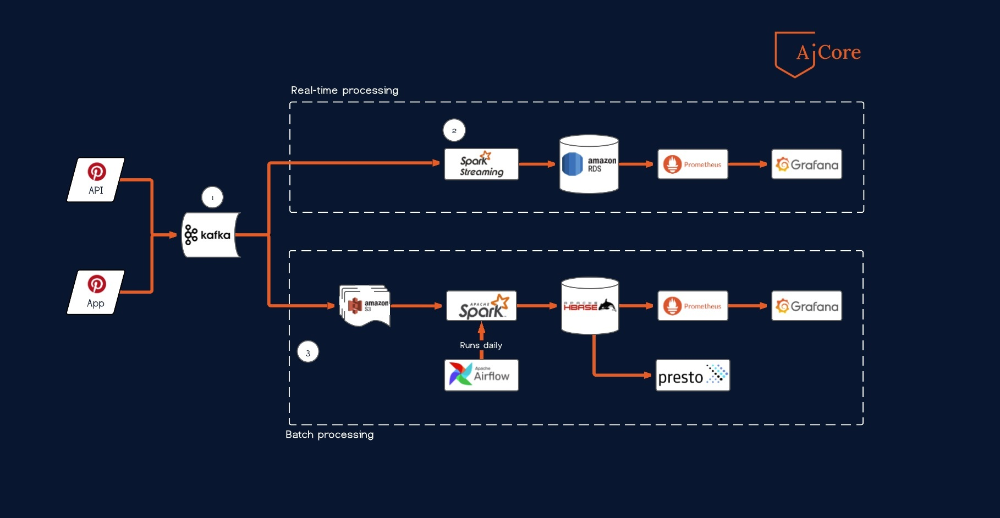

# Pinterest-data-processing-pipeline

## About the project

This project is part of the curriculum of the Data Engineering pathway of **AiCore**.  All the coding scripts were written in Python. The OS used is a Dual-Boot Ubuntu 20.04. The objective of this project is to build a data pipeline as shown in the figure below.

